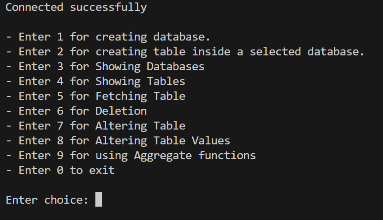

# 🗄️ MySQL Database Management System (Python)

A **menu-driven MySQL Database Management System (DBMS)** built using **Python** and **mysql-connector**.
This project allows users to interact with MySQL databases from the command line and perform both **basic and advanced database operations** without repeatedly writing SQL queries.

It is designed as a **beginner-friendly yet feature-rich DBMS project**, demonstrating practical understanding of databases, SQL operations, and transaction handling.

---

## ✨ Features

### 🔐 Connection

* Connects securely to MySQL using password authentication
* Graceful exit on connection failure

### 📁 Database Operations

* Create a new database
* Show all existing databases
* Delete an existing database

### 📊 Table Operations

* Create tables using custom SQL queries
* Show tables inside a selected database
* Fetch and display all records from a table
* Delete tables from a database

### 🛠️ Alter Table Operations

* Add a new column
* Change datatype of an existing column
* Rename a column
* Delete a column
* Rename a table
* Assign a PRIMARY KEY to a column
* Apply NOT NULL constraint to a column

### 🔄 Data Modification

* Update table values using `SET` and `WHERE` conditions

### 🔢 Aggregate Functions

* COUNT
* SUM
* AVG
* MIN
* MAX

### 🔁 Transaction Handling

* Uses `COMMIT` for successful operations
* Uses `ROLLBACK` on errors
* Prevents crashes using structured exception handling

---

## 🧠 Concepts Covered

* MySQL connectivity with Python
* Menu-driven program design
* SQL operations: CREATE, DROP, ALTER, UPDATE, SELECT
* Aggregate SQL functions
* Transaction management (commit & rollback)
* Error handling using try–except

---

## 🛠️ Technologies Used

* Python
* MySQL
* mysql-connector-python

---

## ▶️ How to Run

1. Ensure MySQL server is running
2. Install MySQL connector:

   ```bash
   pip install mysql-connector-python
   ```
3. Run the Python file
4. Enter your MySQL password when prompted
5. Use the menu options to manage databases

---

## 📋 Menu Options

### Main Menu

1. Create Database
2. Create Table
3. Show Databases
4. Show Tables
5. Fetch Table Records
6. Deletion Operations
7. Alter Table Structure
8. Alter Table Values
9. Aggregate Functions
10. Exit

### Deletion Menu

* Delete Database
* Delete Table

### Alter Table Menu

* Add Column
* Modify Column Datatype
* Rename Column
* Delete Column
* Rename Table
* Assign Primary Key
* Apply NOT NULL Constraint

### Aggregate Functions Menu

* COUNT
* SUM
* AVG
* MIN
* MAX

---

## 🖼️ Screenshots

**Main Menu**


---

## ⚠️ Notes

* This project is intended for **learning and practice purposes**
* Uses raw SQL queries (no ORM)
* SQL injection protection is not implemented
* Best suited for local or testing environments

---

## 🚀 Future Improvements

* Parameterized queries for security
* Better input validation
* Logging instead of print statements
* Separation of UI and database logic
* Enhanced error messages

---

## 📬 Reach Me Out

* GitHub: [https://github.com/anant-tyagi143](https://github.com/anant-tyagi143)
* LinkedIn: [https://linkedin.com/in/anant-tyagi143](https://linkedin.com/in/anant-tyagi143)
* Email: [anant143.gmail@example.com](mailto:anant143.gmail@example.com)

---

## 👨‍💻 Author

**Anant Tyagi**
